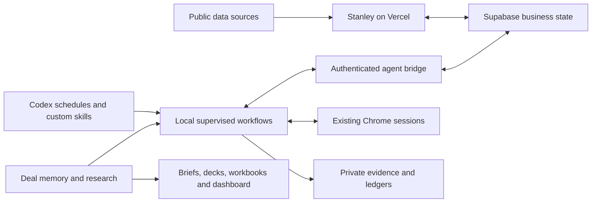

# Codex Automations

A colleague-facing inventory of Arman Sra's Codex work, reviewed **September 11, 2026**. It covers Stanley plus the sales workflows, custom skills, dashboards, research tools, deal-memory systems, document builders, and historical experiments found across the accessible local workspaces.

**82 catalog entries** describe related systems and components. This is **not 82 independent apps or active automations**: some entries are modules within Stanley, implementations of the same workflow, one-off deliverables, or historical/imported material. Six saved Codex automation definitions were found, including one one-time reminder.

## Start here

- For the full software logic: [Stanley architecture](../docs/ARCHITECTURE.md), [infrastructure and setup](../docs/SETUP.md), and [local operational rules](../operations/README.md).
- For what runs when: [scheduled automation inventory](scheduled-automations.md).
- For how thoroughly this was checked: [workspace coverage, evidence, and limitations](workspace-coverage.md).
- For a searchable/exportable index: [catalog.json](catalog.json).

## System map

The hosted app, local scheduled tasks, user-initiated skills, and generated artifacts are separate execution surfaces. Cloning this repository installs none of the operator's schedules, credentials, sessions, or private datasets.

## Status meanings

| Label | What was established |
|---|---|
| Source present | Implementation or reusable instructions exist; this inventory did not rerun every workflow. |
| Configured | A saved automation definition exists. ACTIVE is configuration, not a live health assertion. |
| Artifact present | A built document, dashboard, dataset, or durable knowledge package exists. |
| Historical | Past work or a dated helper exists; current operability is not asserted. |
| Retired | A newer contract, removal result, or source rule supersedes this behavior. |
| Task evidence only | History records the work; a reusable implementation or complete outcome is not established for the entire entry. |
| Imported | Third-party or duplicate material, included to explain coverage, not claimed as a new personal build. |

## Complete index

### [Stanley platform](stanley-platform.md)

Hosted application modules and their shared infrastructure.

| ID | System or work product | Status |
|---|---|---|
| ST01 | [Headhunter: territory and account workspace](stanley-platform.md#st01) | Source present |
| ST02 | [Exact-ID TAL membership synchronization](stanley-platform.md#st02) | Source present |
| ST03 | [TAM record scoring](stanley-platform.md#st03) | Source present |
| ST04 | [Old Gold revival analysis](stanley-platform.md#st04) | Source present |
| ST05 | [Triggered prioritization and review lifecycle](stanley-platform.md#st05) | Source present |
| ST06 | [Missions tasks and reminders](stanley-platform.md#st06) | Source present |
| ST07 | [Kill List pipeline and activity memory](stanley-platform.md#st07) | Source present |
| ST08 | [Ask Stanley chat and voice](stanley-platform.md#st08) | Source present |
| ST09 | [Codex and Claude coordination bridge](stanley-platform.md#st09) | Source present |
| ST10 | [Git-sourced deployment and release verification](stanley-platform.md#st10) | Source present |

### [Public-data and signal engines](signal-engines.md)

Individual source families inside Stanley; these are components, not separate deployed products.

| ID | System or work product | Status |
|---|---|---|
| SG01 | [Hourly rotating source orchestration](signal-engines.md#sg01) | Source present |
| SG02 | [News discovery, identity checks, and candidate review](signal-engines.md#sg02) | Source present |
| SG03 | [Website, careers, ATS, and finance-hiring signals](signal-engines.md#sg03) | Source present |
| SG04 | [TAL-focused monitoring](signal-engines.md#sg04) | Source present |
| SG05 | [FMCSA fleet and carrier foundation](signal-engines.md#sg05) | Source present |
| SG06 | [Colorado entity and UCC monitoring](signal-engines.md#sg06) | Source present |
| SG07 | [Department of Labor Form 5500 foundation](signal-engines.md#sg07) | Source present |
| SG08 | [SBA loan foundation](signal-engines.md#sg08) | Source present |
| SG09 | [SAM entity identity and opportunity discovery](signal-engines.md#sg09) | Source present |
| SG10 | [USAspending prime and subaward signals](signal-engines.md#sg10) | Source present |
| SG11 | [Inc. 5000 and revenue-growth foundation](signal-engines.md#sg11) | Source present |

### [Sales operations and outreach](sales-operations.md)

Supervised workflows using private state and authorized accounts.

| ID | System or work product | Status |
|---|---|---|
| SO01 | [Approved initial email preparation and delivery](sales-operations.md#so01) | Source present |
| SO02 | [Outlook Outreach Cadence Manager](sales-operations.md#so02) | Configured |
| SO03 | [Reply-stop, out-of-office, and suppression reconciliation](sales-operations.md#so03) | Source present |
| SO04 | [Outlook editor rendering and uncertain-send recovery](sales-operations.md#so04) | Source present |
| SO05 | [Monday Morning TAL Touch event invitations](sales-operations.md#so05) | Configured |
| SO06 | [Event invitation follow-up and touch tracking](sales-operations.md#so06) | Source present |
| SO07 | [LinkedIn prospecting and connection provenance](sales-operations.md#so07) | Configured |
| SO08 | [LinkedIn acceptance, backfill, and two-step cadence](sales-operations.md#so08) | Source present |
| SO09 | [NetSuite email activity completion and retry queue](sales-operations.md#so09) | Source present |
| SO10 | [NetSuite LinkedIn and phone-call touch workflows](sales-operations.md#so10) | Source present |
| SO11 | [TAL gifting through Social Imprints](sales-operations.md#so11) | Source present |
| SO12 | [Sales Navigator customer CSV uploads](sales-operations.md#so12) | Source present |
| SO13 | [TAL health and disqualification audit](sales-operations.md#so13) | Artifact present |
| SO14 | [Lead qualification and claiming workflow](sales-operations.md#so14) | Historical |
| SO15 | [Contact research and outreach worklist preparation](sales-operations.md#so15) | Source present |

### [Evidence, data preparation, and reliability](evidence-and-data.md)

Capture, reconciliation, export, and runtime utilities supporting the workflows.

| ID | System or work product | Status |
|---|---|---|
| EV01 | [Full-record NetSuite PDF and text capture](evidence-and-data.md#ev01) | Source present |
| EV02 | [Single-record TAM reader and independent validator](evidence-and-data.md#ev02) | Source present |
| EV03 | [TAM checkpoint, membership, and final reconciliation](evidence-and-data.md#ev03) | Source present |
| EV04 | [TAL and TAM review workbooks and pipeline summaries](evidence-and-data.md#ev04) | Artifact present |
| EV05 | [Current-customer CSV split and verification](evidence-and-data.md#ev05) | Artifact present |
| EV06 | [Browser leases, workflow locks, and bounded execution](evidence-and-data.md#ev06) | Source present |
| EV07 | [State migration, provenance repair, and runtime diagnostics](evidence-and-data.md#ev07) | Historical |
| EV08 | [Early NetSuite export, package validation, and transfer utilities](evidence-and-data.md#ev08) | Historical |

### [Personal skills and daily coordination](personal-skills.md)

Custom instruction packages and locally configured scheduled tasks.

| ID | System or work product | Status |
|---|---|---|
| SK01 | [Arman Sales Ops personal plugin](personal-skills.md#sk01) | Source present |
| SK02 | [Triage Sales Day skill](personal-skills.md#sk02) | Source present |
| SK03 | [Qualify Sales Account skill](personal-skills.md#sk03) | Source present |
| SK04 | [Prepare Sales Action skill](personal-skills.md#sk04) | Source present |
| SK05 | [Morning Sales Focus](personal-skills.md#sk05) | Configured |
| SK06 | [Sales Day Recap](personal-skills.md#sk06) | Configured |
| SK07 | [One-time deal follow-up reminder](personal-skills.md#sk07) | Configured |

### [Research, knowledge, and deal systems](knowledge-and-deals.md)

Reusable methods and their private project implementations.

| ID | System or work product | Status |
|---|---|---|
| KN01 | [Universal intro-call playbook and pain hypothesis](knowledge-and-deals.md#kn01) | Source present |
| KN02 | [Company research and ERP-fit briefs](knowledge-and-deals.md#kn02) | Artifact present |
| KN03 | [Durable deal memory and transcript handoff](knowledge-and-deals.md#kn03) | Artifact present |
| KN04 | [Aviation maintenance evaluation memory and ROI recaps](knowledge-and-deals.md#kn04) | Artifact present |
| KN05 | [Energy marketplace business-model and deal research](knowledge-and-deals.md#kn05) | Artifact present |
| KN06 | [Healthcare staffing evaluation and partner handoff](knowledge-and-deals.md#kn06) | Artifact present |
| KN07 | [Aircraft-services research and battle-card package](knowledge-and-deals.md#kn07) | Artifact present |
| KN08 | [Moving and logistics call memory](knowledge-and-deals.md#kn08) | Artifact present |
| KN09 | [NetSuite product tutor and learning-progress system](knowledge-and-deals.md#kn09) | Artifact present |
| KN10 | [Territory and transcript learning map](knowledge-and-deals.md#kn10) | Artifact present |
| KN11 | [Customer-reference, case-study, and partner research](knowledge-and-deals.md#kn11) | Task evidence only |
| KN12 | [Sales messaging, BANT, and training preparation](knowledge-and-deals.md#kn12) | Task evidence only |
| KN13 | [ERP boundaries and competitive-claim research](knowledge-and-deals.md#kn13) | Task evidence only |

### [Dashboards, documents, and research tools](personal-tools.md)

Standalone tools and repeatable artifact pipelines.

| ID | System or work product | Status |
|---|---|---|
| PT01 | [Offline compensation dashboard](personal-tools.md#pt01) | Artifact present |
| PT02 | [Resume baseline and evidence-backed work library](personal-tools.md#pt02) | Artifact present |
| PT03 | [Tailored resume generation and visual validation](personal-tools.md#pt03) | Source present |
| PT04 | [GTM career-background census](personal-tools.md#pt04) | Source present |
| PT05 | [Public video-channel research library](personal-tools.md#pt05) | Source present |
| PT06 | [Career-company comparison research](personal-tools.md#pt06) | Task evidence only |
| PT07 | [Presentation, battle-card, and architecture builders](personal-tools.md#pt07) | Artifact present |
| PT08 | [Portrait, image cleanup, recolor, and resolution utilities](personal-tools.md#pt08) | Historical |

### [History, experiments, and imported material](history-and-experiments.md)

Retired implementations, task-only work, and items that must not be counted as current user-built systems.

| ID | System or work product | Status |
|---|---|---|
| HX01 | [Sales Nav Upload Continuation Agent](history-and-experiments.md#hx01) | Retired |
| HX02 | [Earlier LinkedIn schedule and provenance backfill](history-and-experiments.md#hx02) | Retired |
| HX03 | [Concurrent TAM worker pools and adaptive queues](history-and-experiments.md#hx03) | Retired |
| HX04 | [Retired signal matching and score inflation paths](history-and-experiments.md#hx04) | Retired |
| HX05 | [BDR lead-count and Slack coordination experiment](history-and-experiments.md#hx05) | Historical |
| HX06 | [Imported Sales Command Center fork](history-and-experiments.md#hx06) | Imported |
| HX07 | [Expenses and compensation-request assistance](history-and-experiments.md#hx07) | Task evidence only |
| HX08 | [Calendar visualization, file inspection, and workflow-video analysis](history-and-experiments.md#hx08) | Task evidence only |
| HX09 | [Training-course assistance and setup troubleshooting](history-and-experiments.md#hx09) | Task evidence only |
| HX10 | [Bundled plugins, runtimes, and duplicated source checkouts](history-and-experiments.md#hx10) | Imported |

## Sharing boundary

The descriptions explain purpose, decision logic, inputs/outputs, infrastructure, and source evidence. Existing Stanley code and reviewed local reference scripts remain available in this repository. Other tools are cataloged, not silently copied or activated.

Private customer identities, contact/profile lists, company-specific suppressions, messages, transcripts, compensation rates/results, live ledgers, CRM PDFs, session data, tokens, and raw Codex history are excluded. Public evidence references to local filenames establish where the owner can find an implementation; they are not links to downloadable private files. This inventory is a dated snapshot, not an automatic monitor.
