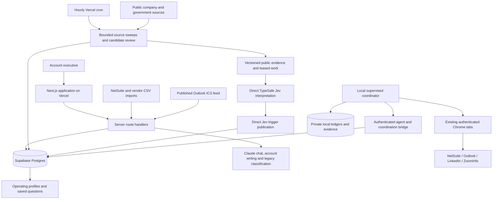
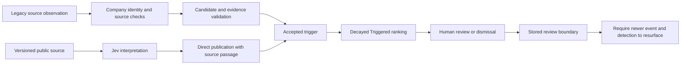

# Stanley architecture and decision logic

Source review: 2026-09-09, with direct Jev intelligence added 2026-09-18. This is an implementation map, not a live-state report. Configuration and receipts with dates are historical evidence.

## System boundaries

The hosted app monitors accounts and manages application tasks. The local coordinator handles account-specific browser work and private checkpoints. They communicate through narrow authenticated routes.

## Identity and membership

NetSuite exports establish the claimable universe. Vendor imports add firmographics and list membership. `lib/baseImport.ts`, `lib/csv.ts`, and `lib/db/companies.ts` implement parsing, precedence, and merges. Import exclusions are in `config/territory.ts`.

TAM is the monitored account universe; TAL is the operator's claimed account set. `lib/tal/membership.ts` resolves TAL replacement by numeric Internal ID only. Retired `tam_duplicate` rows remain history. Missing, unmatched, or multiply resolved IDs stop replacement. `sync_tal_exact_membership` applies the validated set transactionally, followed by exact readback. Removed accounts retain history.

Name/domain matching still exists in other import and cross-tagging paths. It must not be confused with exact TAL membership or permission to grade an ambiguous company.

## TAM and Old Gold

The write contract is `lib/agent/scoreContract.ts`; coercion and enforcement are in `lib/agent/scores.ts`, `scoreWrite.ts`, and `adjust.ts`.

1. Read complete attributable NetSuite evidence. The current local workflow uses one exact-record reader and a separate independent complete validator reread.
2. Assess business fit, stated systems, human interaction recency, specific disqualification, timing, budget, and opportunity history. Generic outreach timestamps are not substantive buying engagement.
3. Produce the TAM grade and required Old Gold / intro-call / opportunity assessment fields. Separate verified facts, hypotheses, and unknowns.
4. Validate payload, identity, full-read provenance, and coordination claim. Dry-run applicable score writes before committing.
5. Publish through the canonical route, verify the exact record and event, and persist a receipt before moving to another record.

`codex_score` retains the raw record grade. `tam_score` is subject to record-dead and confirmed NetSuite-incumbent hard zeros. Public signals cannot add a score delta. An omitted field preserves its value; explicit false or zero is an update.

Old Gold is a revival worklist with an evidence gate, not every low-scoring company. A qualifying row can store an independent revival score, falling back to its TAM grade only when none was supplied. The UI surfaces supported intro-call and opportunity history. See `app/api/headhunter/oldgold/route.ts` and `components/Dashboard.tsx`.

The database snapshots prior values and revalidates score writes under locks. Failure rolls the atomic batch back. See migrations `0046_complete_score_snapshots.sql` and `0050_atomic_agent_score_writes.sql`.

The canonical local grader is paused under its latest handoff. Intelligence deployment does not resume it. Local evidence navigation and optional Jev excerpt annotations are available for a future coordinated grading boundary; public interpretation never supplies a grade delta.

## Public signals and human review

Sources include company-specific Google News, websites/careers pages, transportation records, Colorado business/UCC records, DOL Form 5500, SBA files, Inc. 5000 observations, and verified government-entity/award data. An adapter's presence does not prove that its credentials, foundation data, or schedule are active.

With intelligence enabled, changed publisher bodies enter the Jev queue before the legacy headline filters; the redundant paid headline preclassifier is skipped. Eligible Jev findings publish directly through `lib/intelligence/publish.ts`, preserving the model's scores, native answer fields and selected source passage. They do not enter `candidateReview.ts` or receive a second model's opinion. Existing event-date, exact-account, M&A direction, freshness and explicit-exclusion routing still applies. Jev findings are labeled as interpretations, not independently verified outcomes.

Legacy collectors and the intelligence-disabled news path retain their existing candidate review. `lib/triggers/candidateReview.ts` requires exact-company, concrete-event, high-confidence evidence and the appropriate acquirer direction for M&A. Article-specific Google News RSS evidence supports the existing fallback path; a home/search page is not event proof. Google wrappers do not count as a captured publisher body. URL-safety checks constrain evidence retrieval.

The classifier defaults to `claude-haiku-4-5` unless `MODEL_CLASSIFY` overrides it. SDK retries are disabled in that path. A database compare-and-set counter limits classifier claims to 4,000/week and fails closed when budget state is unavailable. This call cap is not a guaranteed dollar budget independent of the configured model.

When intelligence is enabled, legacy candidate review also uses leased claims, due times and atomic dollar reservations for the supported verifier model. One paid attempt uses one reservation; actual usage settles it and an unknown outcome keeps it reserved. Jev interpretation has its own reservation and direct publication incurs no second-model call. Neither application budget limits the hosting or database bill.

Government evidence uses verified bindings in `lib/publicGrowth/`. Name-only Form D attachment and the legacy name-only USAspending writer are retired. See the [quarantine runbook](SIGNAL_QUARANTINE_RUNBOOK.md).

`lib/triggers/config.ts` defines strengths and half-lives; `lib/db/triggers.ts` computes public trigger priority. Explicit useful/not-now/old-event feedback adds a bounded, smoothed public-priority weight without changing Jev answers or TAM grades. A taxonomy entry alone does not establish that a signal is enabled or actionable.

Review/dismissal stores `trigger_reviewed_through`. Both event date and detection timestamp must be strictly newer before a signal can reheat that account. Missing/invalid dates fail closed once a boundary exists. Exported leads additionally have a 14-day cooling period. This replaces the old README's claim that dismissed leads can never resurface. See `lib/triggers/freshness.ts`, `lib/db/reheat.ts`, and migration `0055_trigger_review_boundary.sql`.

## Scheduling and foundations

The direct Jev engine adds separate five-minute interpretation/direct-publication, baseline collection and directed-research routes, plus a fifteen-minute shared-feed route. Remaining interpretation-route time can service legacy candidates. Both `STANLEY_INTELLIGENCE_ENABLED=true` and the database enable switch are required. Changed observations are durable before interpretation; packet checkpoints avoid repeating compatible completed work. New business-services requests use `stanley-business-services-v2`; the adapter also retains public-scale and evidence-v2 request contracts. These supply public company background, same-source surrounding text, distinct event/collection dates and evidence-linked feedback; retained raw answer distributions remain visible. One oldest due job per claim preserves background progress beside fresh-event priority. Existing source reservations and government publishers remain authoritative. See [Intelligence](INTELLIGENCE.md) for exact limits, migrations, provider terms and activation steps.

`/headhunter/intelligence` provides saved natural-language questions, cross-source operating-topic matches, source evidence, expandable Jev outputs, reversible feedback and processing/spend status. Wrong-company/irrelevant decisions hide the exact observation and its associated Jev trigger; Undo restores retained results or resumes unfinished checkpoints. Company profiles reuse the 21-topic operating library, with bounded source/subindustry questions per packet and distinguish sourced findings, unverified hypotheses and unknowns. Focused refresh rotates previously verified company URLs using stored attempts and leases, then reloads as processing finishes. Shared-source feedback weights retain oldest-source baseline capacity. Private local TAM annotations use a separately gated authenticated route; they never publish a grade.

Exact source reuse and progressive observation cards are implemented. Event-level clustering of different reports, corroboration on a single event, generated account narratives and dedicated material-change/contradiction views remain unimplemented; the current hypotheses use three explicit templates.

`vercel.json` specifies `0 * * * *` for `/api/cron/daily`. The route chooses a stage from the UTC hour and runs five requests concurrently. `lib/cron/dailyPlan.ts` has 80 requests across 16 stages. Each stage contains prime-award work and three ordinary sweep jobs. The remaining slot runs candidate review in 15 stages and one verified-company SAM entity page in the final stage, supplementing bulk public extracts within the free API allocation. Receipts go to `app_events`; cursors/leases preserve progress.

The manifest has coverage targets, including broad-TAM rotation and verified federal-recipient revisits. Outages, missing evidence, exhausted budgets, missing foundations, and provider latency can prevent those targets. Read actual receipts and cursors before declaring coverage complete.

Form 5500, SBA, SAM extract, and Inc. 5000 foundations use explicit scripts and POST ingestion routes. They are not all downloaded by the hourly GET dispatcher. See `scripts/foundation_*.py` and `lib/publicGrowth/`. Full-TAM identity discovery and already-verified identity refresh are distinct operations.

## Missions, Kill List, and conversation

Missions uses deterministic recurrence/placement code around an LLM tool interface. A private published Outlook ICS feed supplies busy blocks, including expanded recurring meetings. Optional Resend-backed calendar invitations are separate from prospecting email and require configuration. Calendar sync has its own route; verify its external schedule rather than assuming the hourly sweep covers it.

Kill List is manually authored pipeline state. Its deterministic bridge turns dated lead tasks into Missions and synchronizes changes. Call-note parsing can derive notes and tasks from the operator's debrief; it must not fabricate pipeline facts.

Chat and module agents expose read tools and structured write actions. Proposal, apply, and confirmation behavior is implemented in the corresponding UI and apply routes; there is no single approval policy to infer from a tool comment. Signals do not automatically create Missions or send prospect outreach.

Model selection differs by entry point: `lib/chat/run.ts` defaults to `claude-opus-4-8`; Missions and Kill List entry points default to `claude-sonnet-5`; `MODEL_CHAT` can override them. Database `app_config` also has model settings for other paths. These are code identifiers, not claims of universal model availability.

## Storage and authentication

| Boundary | Mechanism |
|---|---|
| Browser application | Optional local password gate; configure both `APP_PASSWORD` and `APP_SESSION_TOKEN` for hosted use |
| Agent routes | Dedicated `AGENT_TOKEN` or `CODEX_AGENT_TOKEN` in a header; cron secrets and URL tokens rejected |
| Cron/webhook routes | Route-specific machine authentication with `CRON_SECRET` and applicable growth secret |
| Database | Server-only `serviceClient()`, schema-specific RLS and transactional functions |
| Local browser work | Operator session, one coordinator, shared browser lease, workflow locks |
| Evidence | Private record-text bridge, local PDFs, hash/page-count provenance, exact-ID checkpoints |
| History | `app_events`, `stanley_logs`, `score_snapshots`, coordination events, private run receipts |

Core table families include companies, triggers/candidates, exports, missions/calendar preferences, Kill List records, agent messages/tasks/documents, and TAM coordination. Migrations are the schema authority. Do not create a second membership list or infer current completion from a historical document count.
